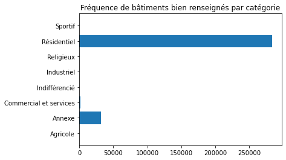
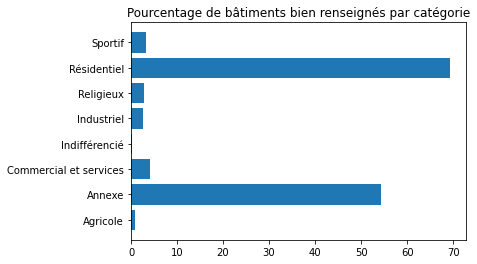
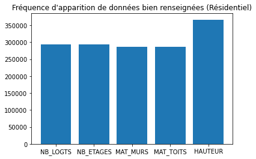

# Rapport d'avancement - 1ère semaine

Pendant cette première semaine, nous avons réalisé quelques statistiques sur l'état actuel des données manquantes de la BD TOPO, en l'occurrence pour le département de Paris (75).\
Nous nous concentrons sur 5 critères : le nombre de logements, le nombre d'étages, le matériau des murs, le matériau du toit et la hauteur du bâtiment.

## 1. Statistiques sur toutes les catégories de bâtiments

Nous avons tout d'abord calculé, pour chaque catégorie de bâtiments, combien d'entre eux sont correctement renseignés (pas de valeur NULL) sur les 5 critères sélectionnés :\
\
 \
\
Puis nous avons rapporté ces résultats à un pourcentage par rapport au nombre total de bâtiments pour chaque catégorie :\
\
 \
\
On constate que le bâti en catégorie 'Résidentiel' et 'Annexe' est plutôt bien renseigné (70% pour l'un, 55% pour l'autre).\
En revanche, pour toutes les autres catégories, le taux de remplissage correct sur les 5 critères ne dépasse pas 10%.

## 2. Statistiques sur le bâti résidentiel

On s'intéresse ensuite plus particulièrement au cas des bâtiments résidentiels, où le renseignement de nos 5 critères est le plus essentiel.\
Cela permet, par exemple, d'estimer la population y résidant (nombre de logements, d'étages), ou d'identifier les bâtiments mal équipés contre les fortes chaleurs (matériaux des murs et du toit).\
\
On observe alors, pour chaque paramètre, le nombre de bâtiments résidentiels où il est correctement renseigné (une valeur égale à 0 étant considérée comme NULL) :\
\
 \
\
Et on calcule le pourcentage :\
\
 \
\
Nous pouvons en conclure que les 4 premiers paramètres sont renseignés dans environ 70% des cas, et un peu plus pour la hauteur (+ de 80%).\
Ainsi, en moyenne, près d'1/3 des bâtiments résidentiels à Paris ont au moins un critère manquant parmi les 5 que nous étudions.
