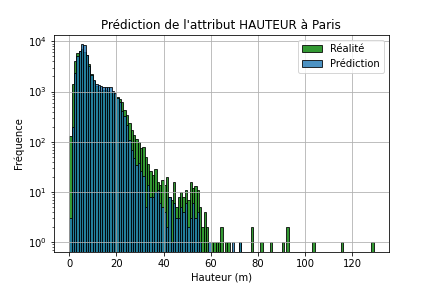
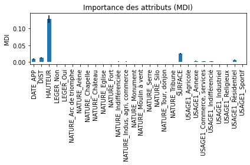
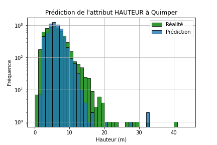
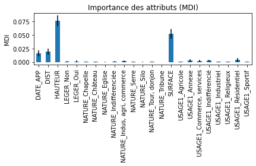

# Rapport d'avancement 10

Pendant cette semaine, nous observons les résultats de l'algorithme "mix" entre RandomForest et k-NN pour conclure sur son efficacité par rapport aux RandomForest et k-NN seuls.

## 1. Résultats de l'algorithme "mix" sur l'est de Paris

Afin d'éviter le sur-apprentissage et obtenir un temps d'exécution raisonnable (environ 1.5 jour), on fixe les paramètres suivants dans la forêt aléatoire :
* ```n_estimators``` = 50 (nombre d'arbres)
* ```max_depth``` = 20 (profondeur maximale des arbres)
* ```n_jobs``` = 4 (parallélisation sur plusieurs cœurs pour optimiser le temps de calcul)

On obtient les résultats suivants sur l'est de Paris :

| Histogramme | FeatureImportances |
|:-:|:-:|
|  |  |

| | *Global* | *-10 m* | *10-30 m* | *+30 m* |
|:-:|:-:|:-:|:-:|:-:|
| **MAE (m)** | **2.1** | 1.6 | 3.1 | 15.4 |

La distribution obtenue est très proche de la réalité pour les bâtiments de hauteur inférieure à 20 m, puis sous-évaluée pour ceux de hauteur entre 20 et 60 m.\
L'algorithme est en revanche peu performant pour les prédictions de hauteur à moins de 2 m (souvent des erreurs de la BD TOPOⓇ d'après de précédentes observations) et à plus de 60 m (peu nombreux, une quinzaine dans ce jeu de test).\
\
On constate que c'est clairement la hauteur des bâtiments voisins qui est l'attribut le plus significatif, suivi de leur surface au sol et leur distance au bâtiment dont on cherche à prédire la hauteur (attributs calculés par le programme).\
Concernant les attributs intrinsèques déjà intégrés à la BD TOPOⓇ, la date d'apparition est légèrement significative ; concernant l'usage, il a une très légère importance dans le cas des bâtiments résidentiels.\
Les autres attributs ont un poids quasiment insignifiant dans la prédiction.\
\
Voici un tableau récapitulatif des prédictions sur l'est de Paris :

| | Histogramme | MAE globale |
|:-:|:-:|:-:|
| **k-NN (+ surface)** |  | 2.7 m |
| **RandomForest** |  | 3.8 m |
| **Mix** |  | **2.1 m** |

| Détail MAE (m) | *Global* | *-10 m* | *10-30 m* | *+30 m* |
|:-:|:-:|:-:|:-:|:-:|
| ***k-NN (+ surface)*** | **2.7** | 2.0 | 4.0 | 18.4 |
| ***RandomForest*** | **3.8** | 2.7 | 6.3 | 23.2 |
| ***Mix*** | **2.1** | 1.6 | 3.1 | 15.4 |

C'est finalement la méthode "mix" entre RandomForest et k-NN qui apparaît comme la plus performante, car elle permet de prédire la hauteur par rapport aux bâtiments les plus proches géographiquement, en particulier ceux dont les caractéristiques intrinsèques sont proches.

## 2. Résultats de l'algorithme "mix" sur Quimper

Voici les résultats obtenus pour la ville de Quimper, avec les mêmes paramètres et un résultat différent du rapport v8 où l'algorithme était mal implémenté :

| Histogramme | FeatureImportances |
|:-:|:-:|
|  |  |

| | *Global* | *-10 m* | *10-30 m* | *+30 m* |
|:-:|:-:|:-:|:-:|:-:|
| **MAE (m)** | **1.3** | 1.1 | 3.2 | 17.6 |

Là encore, cette méthode est la meilleure pour minimiser la MAE en comparaison avec le **k-NN + surface** seul (1.6 m) et le **RandomForest** seul (1.7 m).
