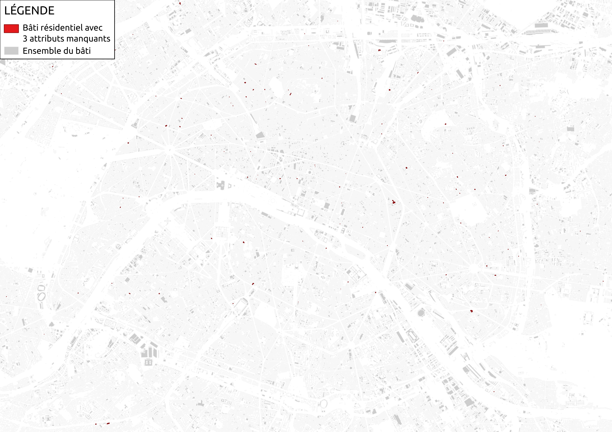

# Rapport d'avancement - 2ème semaine

Pendant cette 2ème semaine de projet, nous testons différentes méthodes d'imputation de données manquantes avec Scikit-Learn, pour la prédiction de hauteurs manquantes sur les bâtiments résidentiels à Paris.

## 1. Visualisation géographique de la répartition du nombre d'attributs manquants à Paris

Nous avons réalisé 6 cartes pour visualiser la localisation des bâtiments résidentiels en fonction du nombre d'attributs qui leur manque :\
\
\
\
\
\
\
\
\
\
\
\
\
\
On peut constater que la présence d'attributs manquants est répartie de façon homogène sur le territoire parisien.\
\
Cependant, on identifie quelques spécificités locales :
  - les bâtiments où il manque 2 attributs sont essentiellement dans le centre historique de Paris ;
  - ceux où il manque 4 ou 5 attributs sont plutôt dans les arrondissements périphériques et en banlieue.

## 2. Prédiction de la hauteur des bâtiments

Nous avons testé l'imputation de données manquantes avec la bibliothèque Scikit-Learn sur Python, dans un premier temps pour la prédiction de la hauteur des bâtiments.\
On commence par cet attribut en particulier car il prend des valeurs continues, ce qui rend l'estimation plus simple à implémenter qu'avec des valeurs discrètes.\
\
Pour cela, nous avons extrait de la BD TOPO sur Paris les bâtiments résidentiels pour lesquels tous les attributs sont renseignés (ceux en rouge sur la première carte).\
Nous avons classé ces bâtiments en 2 jeux de données :
  - un "jeu d'entraînement" où la hauteur est connue (80% du total) ;
  - un "jeu de test" où l'on supprime volontairement cet attribut (20% du total).

L'objectif est de prédire la hauteur des bâtiments du jeu de test, puis de comparer la prédiction avec la hauteur réelle connue.\
On utilise 2 mesures d'erreur : la RMSE (Root Mean Square Error) qui mesure la racine des écarts au carré, et la MAE (Mean Absolute Error) qui mesure (en m) les écarts en valeurs absolues.

### Imputation univariée (moyenne)

Avec l'imputation univariée, l'algorithme affecte à chacun des bâtiments du jeu de test la moyenne des hauteurs connues du jeu d'entraînement.\
Cette méthode est relativement simple à mettre en œuvre, mais peu précise. En effet, elle ne prend pas en compte les caractéristiques des bâtiments qui peuvent varier entre les différents quartiers de la ville.\
\
On obtient finalement les erreurs suivantes :
  - **RMSE :** 6.8
  - **MAE :** 5.4 m

### Imputation multivariée (K-NN)

L'imputation multivariée permet de prendre en compte davantage de facteurs pour rendre la prédiction plus précise : ...
