# Rapport d'avancement - 3ème semaine

Pendant cette 3ème semaine de projet, nous nous concentrons sur l'imputation par plus proches voisins, en essayant de pousser plus loin l'interprétation des résultats obtenus et d'améliorer la méthode.

## 1. Interprétation des résultats : R² et histogrammes

Nous avons réalisé une nouvelle série de prédictions par plus proches voisins, en calculant cette fois-ci en plus le coefficient de détermination R² de l'estimation.\
Par ailleurs, nous avons ajouté à chaque prédiction l'histogramme des hauteurs prédites, afin de comparer leur répartition avec la réalité.\
Les résultats de cette nouvelle estimation sont compilés dans le tableau suivant :

| k-NN | RMSE | MAE | R² | Prédiction | Réalité |
|:---------:|:---------:|:---------:|:---------:|:---------:|:---------:|
| 1 | 4.5 | 2.5 m | 0.56 | 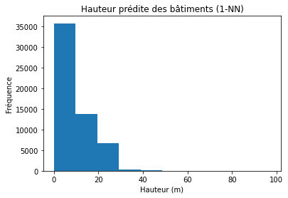 | 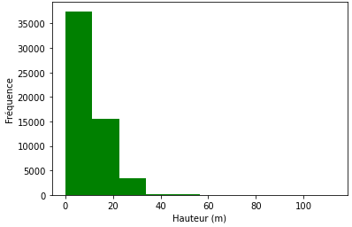 |
| 2 | 4.1 | 2.4 m | 0.64 | 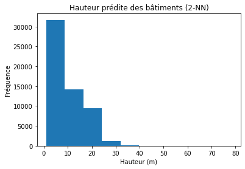 |  |
| 3 | 4.0 | 2.4 m | 0.65 | 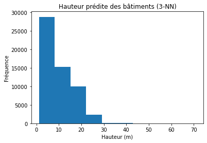 |  |
| 4 | 4.0 | 2.5 m | 0.65 | 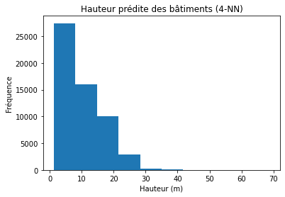 |  |
| 5 | 4.0 | 2.5 m | 0.66 | 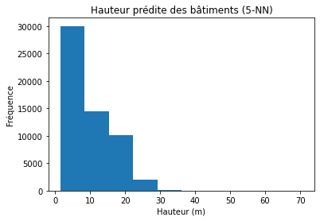 |  |
| 6 | 4.0 | 2.5 m | 0.65 | 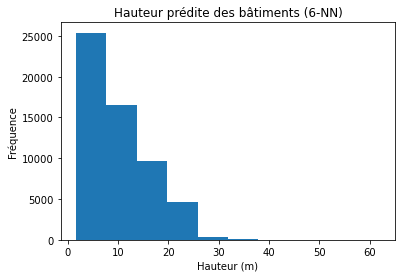 |  |
| 7 | 4.0 | 2.5 m | 0.65 | 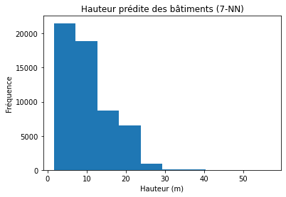 |  |
| 8 | 4.1 | 2.6 m | 0.65 | 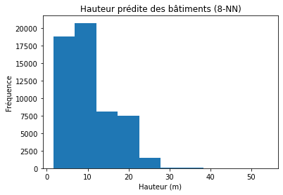 |  |
| 9 | 4.1 | 2.6 m | 0.64 | 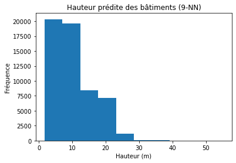 |  |
| 10 | 4.1 | 2.6 m | 0.64 | 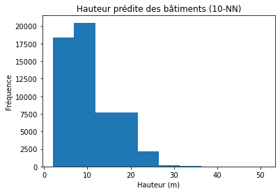 |  |

## 2. Ajout d'un nouvel attribut dans le calcul

Pour essayer d'améliorer le résultat de l'estimation, nous avons ensuite intégré un nouvel attribut de surface pour chaque bâtiment résidentiel, calculé directement avec QGIS.\
Ainsi, l'algorithme doit désormais prédire la hauteur en observant les bâtiments les plus proches géographiquement, mais aussi ceux dont la surface est similaire.\
Dans un premier temps, nous avons choisi d'affecter le même poids pour ce nouvel attribut que pour les coordonnées ; la formule de distance à minimiser devient donc, pour 2 bâtiments de centroïdes $(x_i, y_i)$ et de surface $s_i$ :

$d = \sqrt{(x_1 - x_2)² + (y_1 - y_2)² + (s_1 - s_2)²}$

Par manque de temps, nous n'avons pu réaliser la prédiction que pour 1 à 4 voisins, et sur 2 répartitions de jeux de données (train / test) différentes :\

1er jeu de données
| k-NN | RMSE | MAE | R² | Prédiction | Réalité |
|:---------:|:---------:|:---------:|:---------:|:---------:|:---------:|
| 1 | 4.9 | 3.0 m | 0.47 | 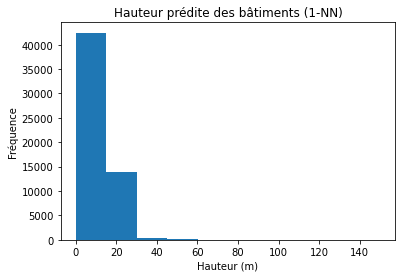 |  |
| 2 | 4.4 | 2.8 m | 0.59 | 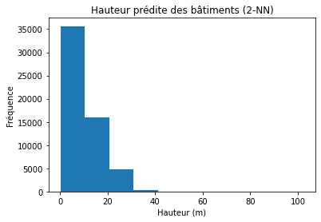 |  |

2ème jeu de données
| k-NN | RMSE | MAE | R² | Prédiction | Réalité |
|:---------:|:---------:|:---------:|:---------:|:---------:|:---------:|
| 3 | 4.2 | 2.7 m | 0.62 |  | 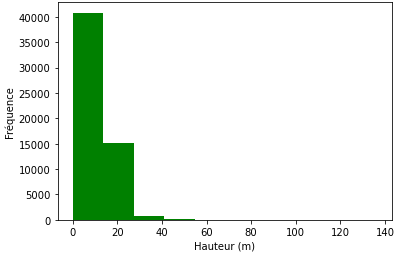 |
| 4 | 4.2 | 2.7 m | 0.63 | 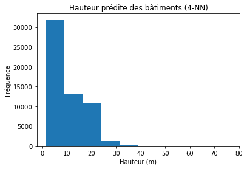 |  |
