# Rapport d'avancement - 4ème semaine

Pendant cette 4ème semaine de projet, nous tentons d'améliorer la prise en compte de la surface des bâtiments dans la prédiction, et nous nous intéressons à un nouvel attribut à prédire : le nombre de logements.

## 1. Création d'une nouvelle mesure de distance

La semaine précédente, nous avions utilisé cette formule pour calculer la "proximité" entre 2 bâtiments de centroïdes $(x_i, y_i)$ et de surface $s_i$ :

$d = \sqrt{(x_1 - x_2)² + (y_1 - y_2)² + (s_1 - s_2)²}$

La surface est considérée comme une 3ème coordonnée dans le calcul ; or ce n'est pas le rôle de cette donnée.\
Pour qu'elle soit prise en compte de façon plus appropriée, nous avons introduit une pondération dans la formule de distance grâce à un facteur $\lambda$ compris entre 0 et 1, qui permet selon sa valeur de faire peser davantage les coordonnées géographiques ou la surface des bâtiments :

$d = \sqrt{\lambda[(x_1 - x_2)² + (y_1 - y_2)²] + (1 - \lambda)(s_1 - s_2)²}$

En Python, l'implémentation nécessite de créer une fonction de distance personnalisée, prenant en argument 2 objets $x$, $y$ et renvoyant la distance scalaire attendue. On la renseigne ensuite lors de l'appel à la fonction KNNImputer de Scikit-Learn, avec le paramètre 'metric'.

Nous avons réalisé une série de tests pour $\lambda \in$ {0, 0.2, 0.4, 0.6, 0.8, 1}, afin d'observer pour quelle valeur l'intégration de la surface des bâtiments est la plus pertinente. Le nombre de voisins $k$ varie toujours entre 1 et 10.

Nous en avons profité pour rendre les résultats plus exploitables, en :
* limitant les histogrammes en abscisse à 60 m (les bâtiments plus hauts étant très rares et presque invisibles sur les graphiques) ;
* découpant les histogrammes en 60 intervalles pour les rendre plus précis (et étudier concrètement l'influence du facteur $\lambda$) ;
* distinguant 3 valeurs différentes de MAE selon la hauteur des bâtiments : basse (- 10 m), moyenne (10 - 30 m) et haute (+ 30 m).

On obtient les résultats suivants :

| **Histogramme réel** | 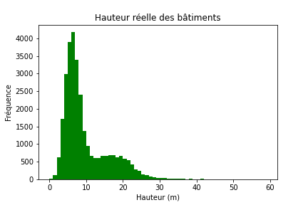 |
|:---------:|:---------:|

\
**1-NN**
| $\lambda$ | RMSE | MAE (-10) | MAE (10-30) | MAE (+30) | R² | Prédiction |
|:---------:|:---------:|:---------:|:---------:|:---------:|:---------:|:---------:|
| **0** | 7.4 | 4.0 m | 7.0 m | 22.0 m | 0.00 | 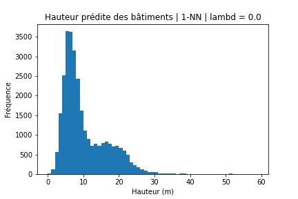 |
| **0.2** | 4.6 | 2.0 m | 4.1 m | 13.0 m | 0.50 |  |
| **0.4** | 4.5 | 1.9 m | 3.9 m | 13.2 m | 0.52 |  |
| **0.6** | 4.5 | 1.8 m | 3.8 m | 12.5 m | 0.53 | 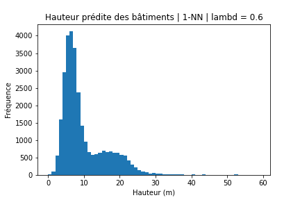 |
| **0.8** | 4.4 | 1.8 m | 3.7 m | 12.1 m | 0.55 |  |
| **1** | 4.5 | 1.7 m | 3.7 m | 14.8 m | 0.53 |  |

\
**2-NN**
| $\lambda$ | RMSE | MAE (-10) | MAE (10-30) | MAE (+30) | R² | Prédiction |
|:---------:|:---------:|:---------:|:---------:|:---------:|:---------:|:---------:|
| **0** | 6.3 | 3.3 m | 6.2 m | 21.4 m | 0.08 | 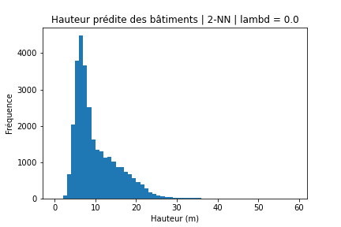 |
| **0.2** | 4.1 | 1.8 m | 3.7 m | 13.7 m | 0.61 |  |
| **0.4** | 4.0 | 1.8 m | 3.6 m | 13.0 m | 0.63 |  |
| **0.6** | 3.9 | 1.7 m | 3.5 m | 12.6 m | 0.64 |  |
| **0.8** | 3.9 | 1.7 m | 3.4 m | 12.5 m | 0.64 |  |
| **1** | 4.1 | 1.7 m | 3.5 m | 15.1 m | 0.61 |  |

\
**3-NN**
| $\lambda$ | RMSE | MAE (-10) | MAE (10-30) | MAE (+30) | R² | Prédiction |
|:---------:|:---------:|:---------:|:---------:|:---------:|:---------:|:---------:|
| **0** | 5.8 | 3.1 m | 5.9 m | 20.9 m | 0.20 | 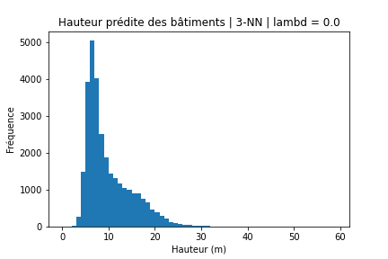 |
| **0.2** | 3.9 | 1.8 m | 3.6 m | 14.0 m | 0.64 |  |
| **0.4** | 3.9 | 1.7 m | 3.5 m | 13.5 m | 0.65 |  |
| **0.6** | 3.8 | 1.7 m | 3.4 m | 13.3 m | 0.66 |  |
| **0.8** | 3.8 | 1.6 m | 3.4 m | 13.5 m | 0.67 |  |
| **1** | 4.0 | 1.7 m | 3.5 m | 16.2 m | 0.63 |  |

\
**4-NN**
| $\lambda$ | RMSE | MAE (-10) | MAE (10-30) | MAE (+30) | R² | Prédiction |
|:---------:|:---------:|:---------:|:---------:|:---------:|:---------:|:---------:|
| **0** | 5.6 | 2.8 m | 5.8 m | 21.0 m | 0.26 | 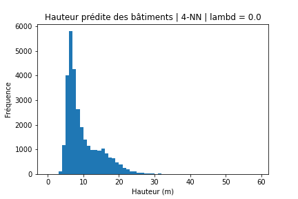 |
| **0.2** | 3.9 | 1.7 m | 3.5 m | 14.3 m | 0.65 |  |
| **0.4** | 3.8 | 1.7 m | 3.4 m | 14.1 m | 0.66 |  |
| **0.6** | 3.8 | 1.7 m | 3.4 m | 13.8 m | 0.67 |  |
| **0.8** | 3.7 | 1.6 m | 3.3 m | 14.1 m | 0.67 |  |
| **1** | 4.0 | 1.7 m | 3.5 m | 16.7 m | 0.63 |  |

\
**5-NN**
| $\lambda$ | RMSE | MAE (-10) | MAE (10-30) | MAE (+30) | R² | Prédiction |
|:---------:|:---------:|:---------:|:---------:|:---------:|:---------:|:---------:|
| **0** | 5.5 | 2.8 m | 5.7 m | 21.1 m | 0.29 | 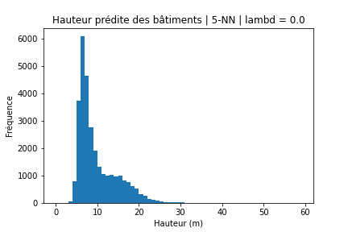 |
| **0.2** | 3.8 | 1.7 m | 3.5 m | 14.7 m | 0.66 |  |
| **0.4** | 3.8 | 1.7 m | 3.4 m | 14.5 m | 0.67 |  |
| **0.6** | 3.7 | 1.7 m | 3.4 m | 14.4 m | 0.67 |  |
| **0.8** | 3.7 | 1.6 m | 3.3 m | 14.7 m | 0.68 | 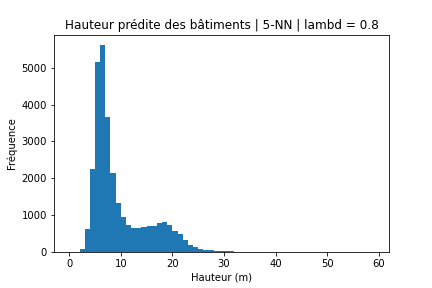 |
| **1** | 4.0 | 1.7 m | 3.5 m | 17.2 m | 0.63 |  |

\
**6-NN**
| $\lambda$ | RMSE | MAE (-10) | MAE (10-30) | MAE (+30) | R² | Prédiction |
|:---------:|:---------:|:---------:|:---------:|:---------:|:---------:|:---------:|
| **0** | 5.4 | 2.7 m | 5.6 m | 21.0 m | 0.31 |  |
| **0.2** | 3.8 | 1.7 m | 3.5 m | 15.2 m | 0.66 |  |
| **0.4** | 3.8 | 1.7 m | 3.4 m | 14.8 m | 0.67 |  |
| **0.6** | 3.7 | 1.7 m | 3.4 m | 14.9 m | 0.68 |  |
| **0.8** | 3.7 | 1.6 m | 3.4 m | 15.0 m | 0.68 |  |
| **1** | 4.0 | 1.7 m | 3.6 m | 17.7 m | 0.63 |  |

\
**7-NN**
| $\lambda$ | RMSE | MAE (-10) | MAE (10-30) | MAE (+30) | R² | Prédiction |
|:---------:|:---------:|:---------:|:---------:|:---------:|:---------:|:---------:|
| **0** | 5.4 | 2.7 m | 5.5 m | 21.0 m | 0.32 |  |
| **0.2** | 3.8 | 1.7 m | 3.5 m | 15.3 m | 0.66 |  |
| **0.4** | 3.8 | 1.7 m | 3.4 m | 15.3 m | 0.67 |  |
| **0.6** | 3.7 | 1.7 m | 3.4 m | 15.1 m | 0.67 |  |
| **0.8** | 3.7 | 1.6 m | 3.4 m | 15.5 m | 0.68 |  |
| **1** | 4.0 | 1.7 m | 3.6 m | 18.0 m | 0.62 |  |

\
**8-NN**
| $\lambda$ | RMSE | MAE (-10) | MAE (10-30) | MAE (+30) | R² | Prédiction |
|:---------:|:---------:|:---------:|:---------:|:---------:|:---------:|:---------:|
| **0** | 5.3 | 2.7 m | 5.5 m | 21.0 m | 0.33 |  |
| **0.2** | 3.8 | 1.7 m | 3.4 m | 15.6 m | 0.66 |  |
| **0.4** | 3.8 | 1.7 m | 3.4 m | 15.6 m | 0.67 |  |
| **0.6** | 3.8 | 1.7 m | 3.4 m | 15.6 m | 0.67 | 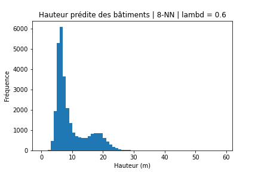 |
| **0.8** | 3.7 | 1.6 m | 3.4 m | 15.9 m | 0.67 |  |
| **1** | 4.0 | 1.7 m | 3.6 m | 18.3 m | 0.62 |  |

\
**9-NN**
| $\lambda$ | RMSE | MAE (-10) | MAE (10-30) | MAE (+30) | R² | Prédiction |
|:---------:|:---------:|:---------:|:---------:|:---------:|:---------:|:---------:|
| **0** | 5.3 | 2.7 m | 5.4 m | 20.9 m | 0.34 | 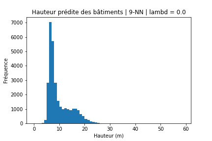 |
| **0.2** | 3.8 | 1.7 m | 3.4 m | 15.8 m | 0.66 |  |
| **0.4** | 3.8 | 1.7 m | 3.4 m | 15.8 m | 0.67 |  |
| **0.6** | 3.8 | 1.7 m | 3.4 m | 15.9 m | 0.67 |  |
| **0.8** | 3.8 | 1.6 m | 3.4 m | 16.4 m | 0.67 |  |
| **1** | 4.1 | 1.7 m | 3.6 m | 18.7 m | 0.62 |  |

\
**10-NN**
| $\lambda$ | RMSE | MAE (-10) | MAE (10-30) | MAE (+30) | R² | Prédiction |
|:---------:|:---------:|:---------:|:---------:|:---------:|:---------:|:---------:|
| **0** | 5.3 | 2.6 m | 5.4 m | 20.8 m | 0.35 |  |
| **0.2** | 3.8 | 1.7 m | 3.4 m | 16.1 m | 0.66 |  |
| **0.4** | 3.8 | 1.7 m | 3.4 m | 16.1 m | 0.66 | 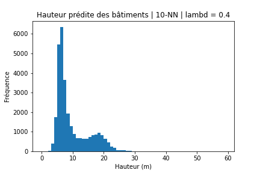 |
| **0.6** | 3.8 | 1.7 m | 3.4 m | 16.2 m | 0.67 |  |
| **0.8** | 3.8 | 1.7 m | 3.5 m | 16.7 m | 0.66 |  |
| **1** | 4.1 | 1.7 m | 3.7 m | 19.0 m | 0.61 | 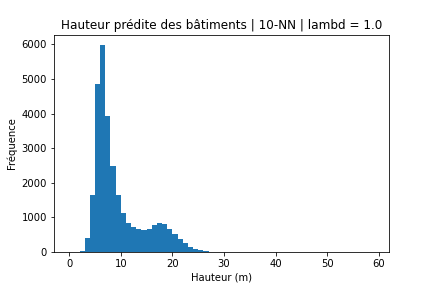 |

\
En analysant les résultats avec les valeurs de $k$ les plus pertinentes (entre 3 et 7 d'après un précédent calcul), on observe que :
* pour $\lambda$ = 0 : la prédiction est mauvaise (R² entre 0.2 et 0.3), ce qui n'est pas étonnant car la proximité géographique des bâtiments n'est pas prise en compte, seulement la surface ; or on suppose que c'est parce que 2 bâtiments sont proches géographiquement qu'ils auront une hauteur similaire ;

* en augmentant la valeur de $\lambda$, la prédiction s'améliore : elle est la meilleure avec $\lambda$ = 0.8 pour les bâtiments de moins de 30 m de haut, et $\lambda$ = 0.6 pour les autres ;

* pour $\lambda$ = 1 : on retrouve une distance qui ne prend en compte que la proximité géographique, et on constate que la qualité de la prédiction diminue un peu.

Finalement, on retient que la prise en compte de la surface des bâtiments permet d'améliorer la prédiction, dans la mesure où le poids de cette surface est faible par rapport aux coordonnées géographiques qui restent un critère de similarité plus fiable.\
\
Pour les bâtiments de - de 10 m de haut : une pondération avec 80% coordonnées / 20% surface permet une réduction de MAE d'environ 10 cm sur 2 m.\
Pour les bâtiments de 10 à 30 m de haut : une pondération avec 80% coordonnées / 20% surface permet une réduction de MAE d'environ 20 cm sur 3.5 m.\
Pour les bâtiments de + de 30 m de haut : une pondération avec 60% coordonnées / 40% surface permet une réduction de MAE d'environ 3 m sur 17 m.\
\
Cela ne représente cependant qu'une amélioration légère de la prédiction : de l'ordre de 5% dans les 2 premiers cas, et 15% pour le 3ème.

## 2. Prédiction du nombre de logements
