# Rapport d'avancement - 5ème semaine

Pendant cette 5ème semaine de projet, nous nous intéressons à un nouvel attribut à prédire : le nombre de logements.

## 1. Explication du processus

Pour cette nouvelle prédiction, on prend désormais en compte les coordonnées géographiques des centroïdes, la surface des bâtiments, et on décide d'ajouter le volume. En effet, on sait d'après cette référence bibliographique [À INSÉRER] que la surface, la hauteur et le volume d'un bâtiment sont corrélés ; on se demande donc si l'ajout de cette information supplémentaire permet ou non d'améliorer la prédiction.\
Le volume des bâtiments n'étant pas fourni dans la couche de données issue de la BD TOPO, on peut ajouter simplement une estimation de cette valeur à partir de la surface $s$ et de la hauteur $h$ :

$v = s * h$

Pour intégrer ce volume dans le calcul de distance, on décide de lui donner un poids équivalent à la surface, qui est toujours dépendante d'un paramètre $\lambda$ permettant de pondérer davantage la distance par rapport aux coordonnées géographiques $(x, y)$ ou aux surface $s$ et volume $v$, d'où la formule :

$d = \sqrt{\lambda[(x_1 - x_2)² + (y_1 - y_2)²] + (1 - \lambda)[(s_1 - s_2)² + (v_1 - v_2)²]}$

Un autre élément important concerne le format des valeurs prédites : contrairement à la hauteur qui est réelle, le nombre de logements est nécessairement un entier naturel.\
Il est donc nécessaire de discrétiser les prédictions obtenues, ce que l'on fait en les arrondissant à l'entier le plus proche ; bien que cela ait également un impact sur la qualité de la valeur prédite.\
\
Le nombre de logements à estimer pouvant grandement varier entre une petite maison individuelle (1 logement) et un grand immeuble (plusieurs centaines de logements), on choisit là encore de répartir la MAE en 3 catégories :
* $-$ de 10 logements
* 10 à 100 logements
* $+$ de 100 logements

## 2. Résultats

On obtient les résultats suivants :

| **Histogramme réel** | 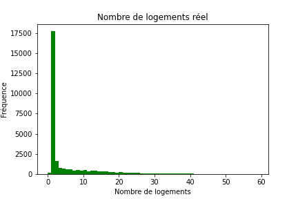 |
|:---------:|:---------:|

\
**1-NN**
| $\lambda$ | RMSE | MAE (-10) | MAE (10-100) | MAE (+100) | R² | Prédiction |
|:---------:|:---------:|:---------:|:---------:|:---------:|:---------:|:---------:|
| **0** |  |  m |  m |  m |  | 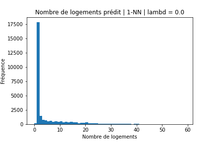 |
| **0.2** |  |  m |  m |  m |  |  |
| **0.4** |  |  m |  m |  m |  | 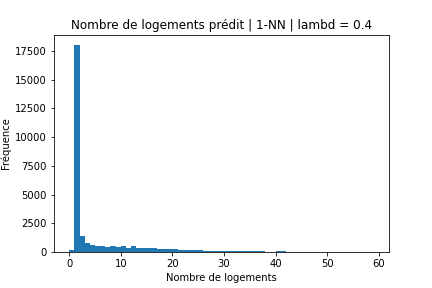 |
| **0.6** |  |  m |  m |  m |  | 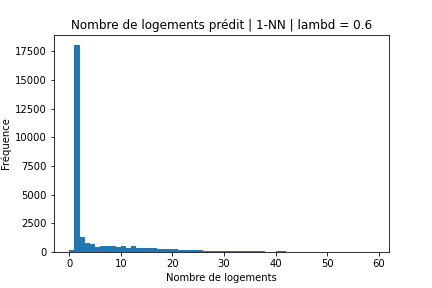 |
| **0.8** |  |  m |  m |  m |  | 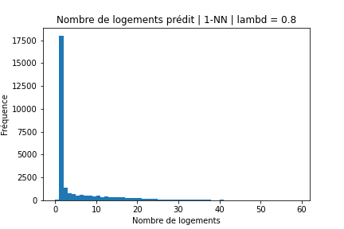 |
| **1** |  |  m |  m |  m |  |  |

\
**2-NN**
| $\lambda$ | RMSE | MAE (-10) | MAE (10-100) | MAE (+100) | R² | Prédiction |
|:---------:|:---------:|:---------:|:---------:|:---------:|:---------:|:---------:|
| **0** |  |  m |  m |  m |  |  |
| **0.2** |  |  m |  m |  m |  | 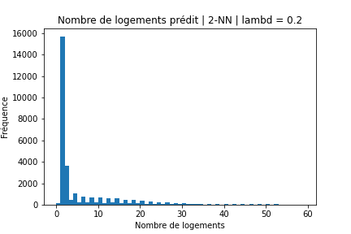 |
| **0.4** |  |  m |  m |  m |  | 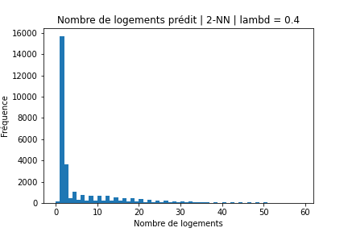 |
| **0.6** |  |  m |  m |  m |  | 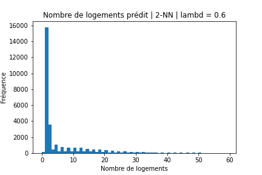 |
| **0.8** |  |  m |  m |  m |  |  |
| **1** |  |  m |  m |  m |  | 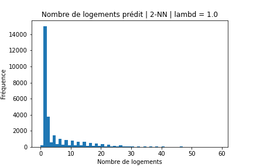 |

\
**3-NN**
| $\lambda$ | RMSE | MAE (-10) | MAE (10-100) | MAE (+100) | R² | Prédiction |
|:---------:|:---------:|:---------:|:---------:|:---------:|:---------:|:---------:|
| **0** |  |  m |  m |  m |  | 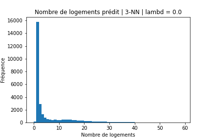 |
| **0.2** |  |  m |  m |  m |  |  |
| **0.4** |  |  m |  m |  m |  |  |
| **0.6** |  |  m |  m |  m |  | 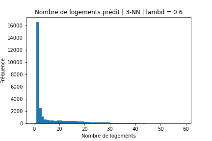 |
| **0.8** |  |  m |  m |  m |  | 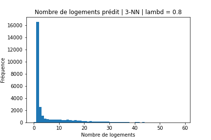 |
| **1** |  |  m |  m |  m |  | 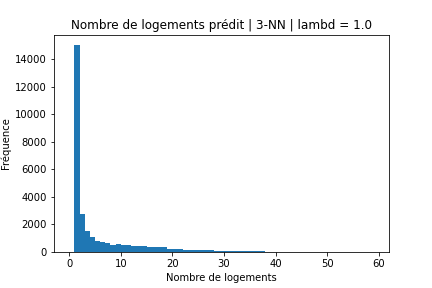 |

\
**4-NN**
| $\lambda$ | RMSE | MAE (-10) | MAE (10-100) | MAE (+100) | R² | Prédiction |
|:---------:|:---------:|:---------:|:---------:|:---------:|:---------:|:---------:|
| **0** |  |  m |  m |  m |  |  |
| **0.2** |  |  m |  m |  m |  |  |
| **0.4** |  |  m |  m |  m |  |  |
| **0.6** |  |  m |  m |  m |  |  |
| **0.8** |  |  m |  m |  m |  |  |
| **1** |  |  m |  m |  m |  |  |

\
**5-NN**
| $\lambda$ | RMSE | MAE (-10) | MAE (10-100) | MAE (+100) | R² | Prédiction |
|:---------:|:---------:|:---------:|:---------:|:---------:|:---------:|:---------:|
| **0** |  |  m |  m |  m |  | 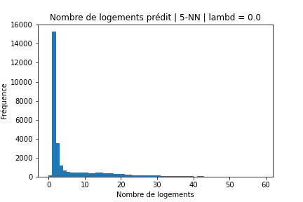 |
| **0.2** |  |  m |  m |  m |  |  |
| **0.4** |  |  m |  m |  m |  | 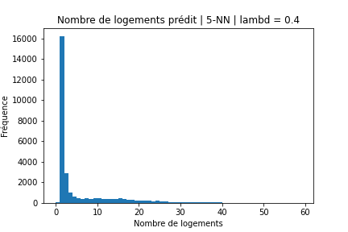 |
| **0.6** |  |  m |  m |  m |  |  |
| **0.8** |  |  m |  m |  m |  |  |
| **1** |  |  m |  m |  m |  | 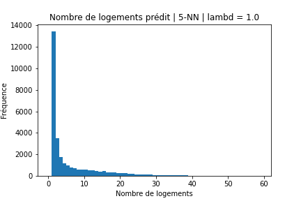 |

\
**6-NN**
| $\lambda$ | RMSE | MAE (-10) | MAE (10-100) | MAE (+100) | R² | Prédiction |
|:---------:|:---------:|:---------:|:---------:|:---------:|:---------:|:---------:|
| **0** |  |  m |  m |  m |  |  |
| **0.2** |  |  m |  m |  m |  |  |
| **0.4** |  |  m |  m |  m |  |  |
| **0.6** |  |  m |  m |  m |  |  |
| **0.8** |  |  m |  m |  m |  |  |
| **1** |  |  m |  m |  m |  | 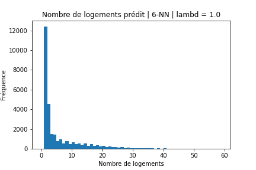 |

\
**7-NN**
| $\lambda$ | RMSE | MAE (-10) | MAE (10-100) | MAE (+100) | R² | Prédiction |
|:---------:|:---------:|:---------:|:---------:|:---------:|:---------:|:---------:|
| **0** |  |  m |  m |  m |  | 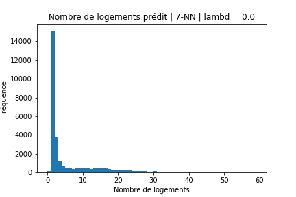 |
| **0.2** |  |  m |  m |  m |  |  |
| **0.4** |  |  m |  m |  m |  |  |
| **0.6** |  |  m |  m |  m |  |  |
| **0.8** |  |  m |  m |  m |  | 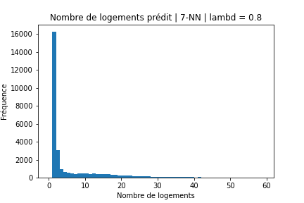 |
| **1** |  |  m |  m |  m |  | 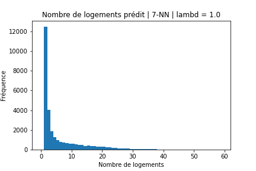 |

\
**8-NN**
| $\lambda$ | RMSE | MAE (-10) | MAE (10-100) | MAE (+100) | R² | Prédiction |
|:---------:|:---------:|:---------:|:---------:|:---------:|:---------:|:---------:|
| **0** |  |  m |  m |  m |  |  |
| **0.2** |  |  m |  m |  m |  | 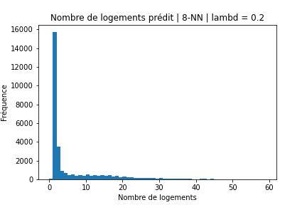 |
| **0.4** |  |  m |  m |  m |  | 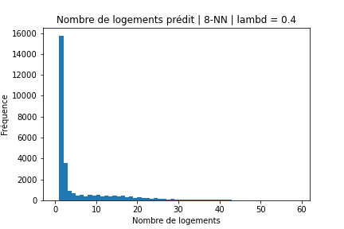 |
| **0.6** |  |  m |  m |  m |  | 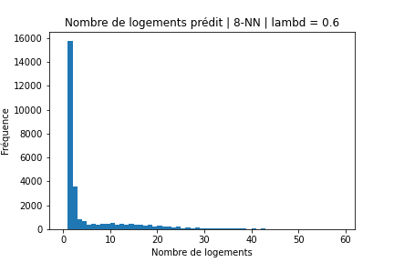 |
| **0.8** |  |  m |  m |  m |  |  |
| **1** |  |  m |  m |  m |  |  |

\
**9-NN**
| $\lambda$ | RMSE | MAE (-10) | MAE (10-100) | MAE (+100) | R² | Prédiction |
|:---------:|:---------:|:---------:|:---------:|:---------:|:---------:|:---------:|
| **0** |  |  m |  m |  m |  |  |
| **0.2** |  |  m |  m |  m |  |  |
| **0.4** |  |  m |  m |  m |  |  |
| **0.6** |  |  m |  m |  m |  |  |
| **0.8** |  |  m |  m |  m |  |  |
| **1** |  |  m |  m |  m |  | 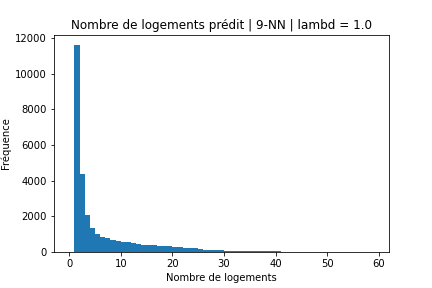 |

\
**10-NN**
| $\lambda$ | RMSE | MAE (-10) | MAE (10-100) | MAE (+100) | R² | Prédiction |
|:---------:|:---------:|:---------:|:---------:|:---------:|:---------:|:---------:|
| **0** |  |  m |  m |  m |  | 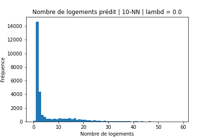 |
| **0.2** |  |  m |  m |  m |  |  |
| **0.4** |  |  m |  m |  m |  |  |
| **0.6** |  |  m |  m |  m |  |  |
| **0.8** |  |  m |  m |  m |  |  |
| **1** |  |  m |  m |  m |  |  |
