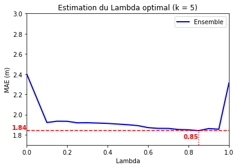
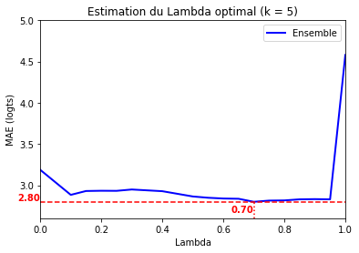
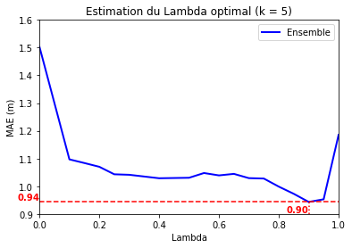
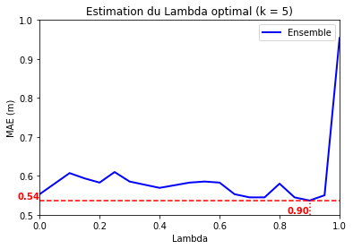

# Rapport d'avancement 6

Après avoir réalisé beaucoup d'expérimentations, on souhaite désormais fixer nos modèles de prédictions de la hauteur et du nombre de logements avec les configurations optimales. Nous étendons également ces modèles à une ville de taille plus modeste afin d'observer leur efficacité dans un environnement urbain différent de Paris.

## 1. Fixation des modèles de prédiction

Pour travailler plus efficacement dans la suite du projet, nous fixons un certain nombre d'éléments de nos modèles de prédictions :

* les jeux de données dits "d'apprentissage" et "de test" sont déterminés par une graine qui génère toujours la même répartition, ce qui permet si besoin de répéter un même test avec la garantie d'obtenir le même résultat ;
* le nombre de voisins $k$ semble n'avoir que peu d'influence tant qu'il est compris entre 3 et 7 d'après nos tests précédents, c'est pourquoi on pose pour la suite $k = 5$.

Nous affinons également les formules de calcul de distance entre 2 bâtiments pour qu'elles soient adaptées à l'attribut à déterminer tout en évitant la redondance.\
On pose alors, pour 2 bâtiments de centroïdes de coordonnées $(x_i, y_i)$, de surface au sol $s_i$, de hauteur $h_i$ et de volume $v_i = s_i * h_i$ :

$d_{hauteur} = \sqrt{\lambda[(x_1 - x_2)² + (y_1 - y_2)²] + (1 - \lambda_h)(s_1 - s_2)²}$

$d_{logements} = \sqrt{\lambda[(x_1 - x_2)² + (y_1 - y_2)²] + (1 - \lambda_l)(v_1 - v_2)²}$

avec $\lambda_h$ et $\lambda_l$ (désignés indistinctement par $\lambda$) des coefficients de pondération entre coordonnées géographiques et surface / volume, dont on souhaite déterminer la valeur optimale (entre 0 et 1).\
\
Pour cela, nous allons réaliser plusieurs séries de prédictions sur chacun des attributs à déterminer, et avec différentes valeurs de $\lambda$.\
L'objectif est de déterminer celle qui, dans chaque cas, minimise la MAE (erreur moyenne absolue, en m ou nombre de logements) de l'ensemble du jeu de test.\
\
Afin de réduire le temps de calcul tout en obtenant des tendances globales, on réduit dans la suite le jeu de données de test à 10% de sa taille réelle.

## 2. Étude sur une grande ville : Paris et proche banlieue

Nous commençons par travailler sur Paris, grande métropole très dense composée essentiellement d'immeubles et de taille variable, allant du bâtiment haussmannien à la grande tour d'habitation.\
La zone d'étude comprend tout de même un certain nombre de maisons individuelles, le jeu de données issu de la BD TOPO® incluant la proche banlieue dont une partie du département du Val-de-Marne (94).\
\
On obtient les résultats suivants :

| Prédiction HAUTEUR sur Paris |  |
|:----------:|:---------:|

* On trouve une MAE minimale pour $\lambda = 0.85$, ce qui implique une forte pondération des coordonnées par rapport à la surface.\
Cela est cohérent avec nos tests précédents, où nous avions remarqué que la proximité géographique est un facteur plus déterminant dans la prédiction de la hauteur que la surface au sol.

| Prédiction NB_LOGTS sur Paris |  |
|:---------:|:---------:|

* On trouve une MAE minimale pour $\lambda = 0.70$, soit une valeur du coefficient légèrement plus faible.\
Nous avions constaté que la surface et le volume étaient plus déterminants dans la prédiction du nombre de logements d'un bâtiment que la proximité géographique ; cependant dans ce jeu de test, les coordonnées apparaissent comme plus pertinentes que le volume. On pourrait peut-être éclaircir cela en séparant les MAE selon le nombre de logements réel des bâtiments, ou en rétablissant le jeu de test à sa taille d'origine.

## 3. Étude sur une ville moyenne : Quimper

Nous travaillons ensuite sur la ville de Quimper, ville moyenne située en Bretagne. En tant que préfecture du Finistère (29), elle compte 65 000 habitants et possède également une diversité de bâtiments résidentiels entre le centre historique (petits immeubles) et la périphérie (maisons individuelles et barres d'immeubles).\
On se demande donc quel serait le modèle de prédiction optimal pour une ville de dimension plus modeste comme Quimper.\
\
En réitérant le même processus, on obtient les résultats suivants :

| Prédiction HAUTEUR sur Quimper |  |
|:---------:|:---------:|

* On trouve une MAE minimale pour $\lambda = 0.90$, soit un résultat très proche de celui trouvé pour Paris.

| Prédiction NB_LOGTS sur Quimper |  |
|:---------:|:---------:|

* /!\ Contrairement à ce qui est indiqué sur l'axe des ordonnées, la MAE est bien en nombre de logements et non en m.
* On trouve une MAE minimale pour $\lambda = 0.90$ également, ce qui est différent de Paris (bien qu'on observe un autre pic similaire pour $\lambda = 0.75$).\
Cela s'explique peut-être par la faible proportion de grands immeubles sur la commune de Quimper : étant très localisés, les coordonnées géographiques sembleraient très pertinentes pour prédire un nombre de logements élevé.\
Une autre raison possible mais corrélée est la surreprésentation de maisons individuelles : on constate en effet que, quelle que soit la valeur de $\lambda$ (sauf 1), la MAE est inférieure à 1 logement sur Quimper. On constate par ailleurs sur le graphique que les variations de MAE sont de l'ordre du centième de logement, soit insignifiantes.

## 4. Bilan et visualisation des résultats

Voici le bilan des résultats obtenus sur Paris et Quimper, avec 10% seulement des jeux de tests utilisés :
| Ville | $\lambda_h$ optimal | $\lambda_l$ optimal |
|:---------:|:---------:|:---------:|
| Paris | $0.85$ | $0.70$ |
| Quimper | $0.90$ | $0.90$ |

Pour déterminer si la qualité de la prédiction est à peu près homogène sur l'ensemble de la zone d'étude, ou alors si elle dépend des quartiers, nous avons réalisé une nouvelle série de prédictions avec $k = 5$ et $\lambda$ optimal selon la ville et l'attribut à prédire. Nous avons ajouté à la couche initiale de bâtiments un attribut indiquant l'erreur de prédiction, ce qui nous a permis de réaliser une visualisation de ces erreurs par bâtiment sur QGIS.\
Ces visualisations sont disponibles ici pour [Paris](../Code/couches/paris-est/visu_err_paris-est_10.7z) et [Quimper](../Code/couches/quimper/visu_err_quimper_10.zip).\
\
Nous réaliserons dans un second temps de nouveaux tests sur les jeux de données entiers afin de confirmer ou non ces premières tendances.
