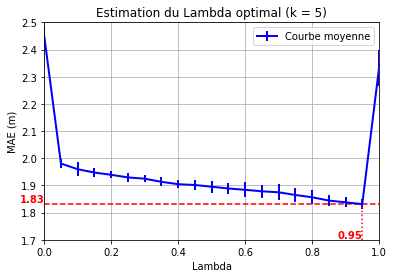
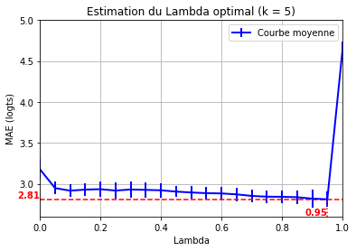
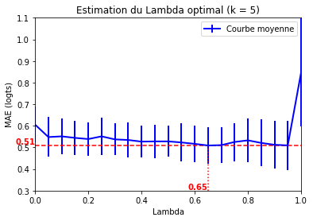
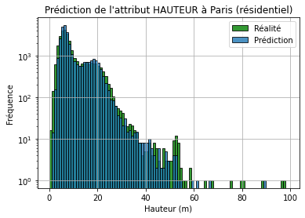
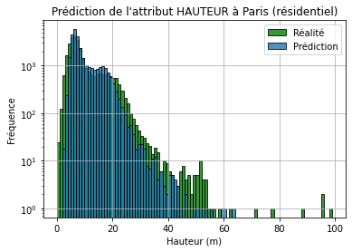
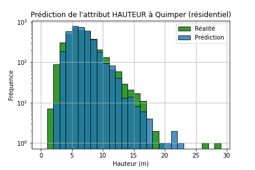
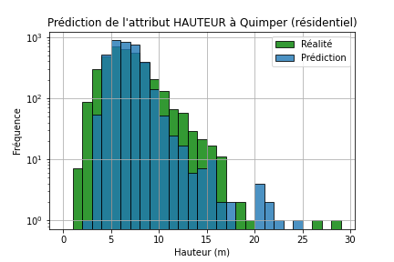
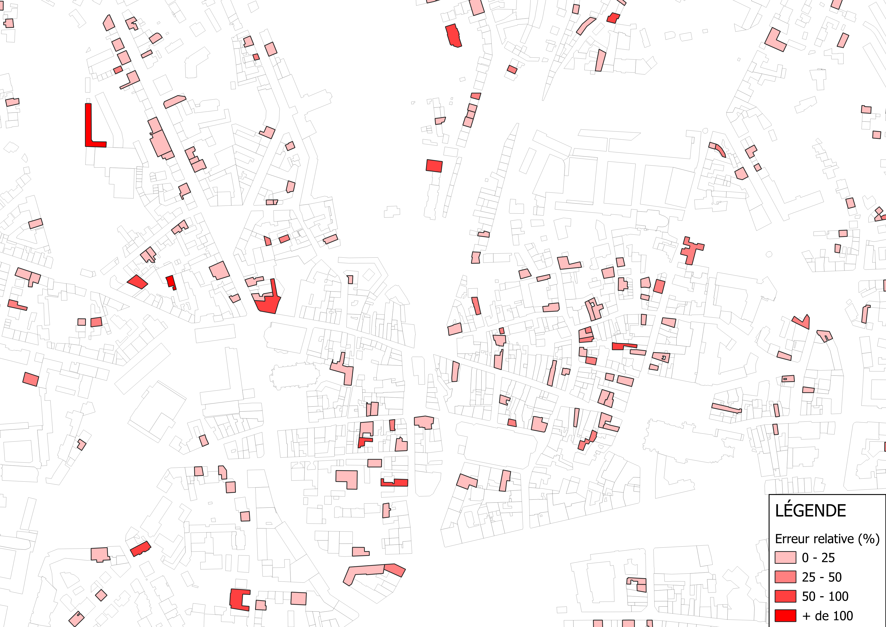
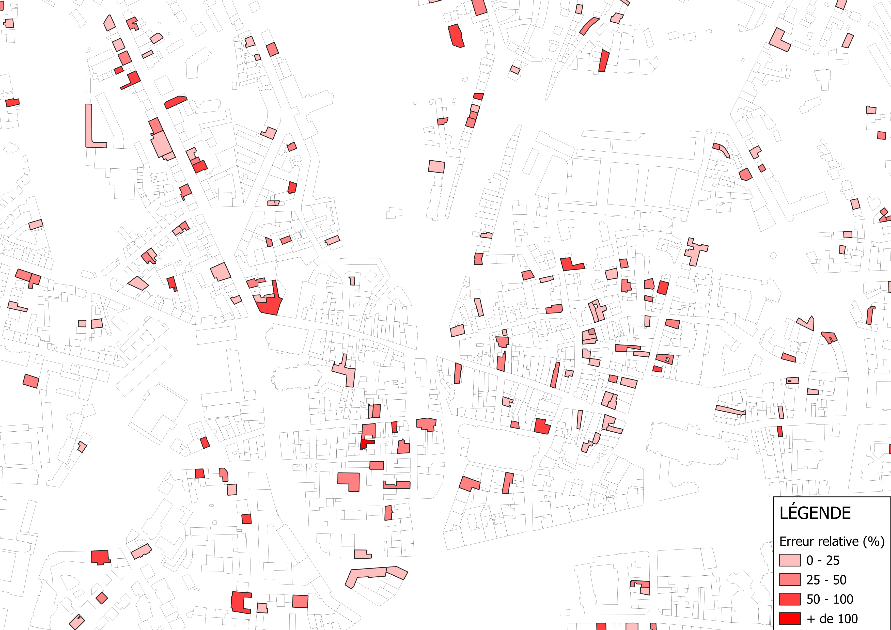

# Rapport d'avancement 7

Pendant cette semaine, nous approfondissons le protocole de la semaine précédente sur la prédiction par K-NN optimale, et nous comparons les résulats obtenus avec ceux d'une nouvelle méthode de prédiction : la forêt aléatoire.

## 1. Amélioration de la prédiction par K-NN

La semaine précédente, nous avions testé différentes valeurs du coefficient de pondération $\lambda$ entre $0$ et $1$ afin de trouver celle qui minimise la MAE.\
Nous avons réitéré ce processus, cette fois-ci sur 5 jeux de données différents dans Paris et Quimper, afin d'obtenir une tendance globale et trouver la valeur de $\lambda$ la plus intéressante pour chaque ville.\
À chaque essai est également associé son écart-type.
\
Nous obtenons les graphiques suivants (à gauche Paris, à droite Quimper) :

| Prédiction HAUTEUR |  |  |
|:----------:|:---------:|:---------:|

On retrouve pour la hauteur des résultats assez proches : la composante géographique est clairement plus significative que la surface.

| Prédiction NB_LOGTS |  |  |
|:----------:|:---------:|:---------:|

Là encore le résultat est proche pour Paris ; en revanche, pour Quimper, on constate qu'une pondération légèrement supérieure qu'auparavant du volume des bâtiments est plus appropriée ($\lambda = 0.65$ au lieu de $\lambda = 0.90$).

## 2. Implémentation de la forêt aléatoire

Nous testons maintenant un nouveau type de prédiction : la forêt aléatoire.\
Cet algorithme va générer aléatoirement une série d'arbres de décisions basés sur différents attributs des bâtiments, afin d'identifier la manière la plus efficace de discriminer la hauteur d'un bâtiment en fonction de ces attributs.\
\
Pour cette implémentation, nous utilisons la fonction RandomForestRegressor() du module scikit-learn.\
Les attributs retenus sont, pour chaque bâtiment :
* sa nature ;
* son usage principal ;
* sa structure (légère ou non) ;
* sa date d'apparition (si connue, sinon mise à 0) ;
* sa surface au sol.

## 3. Comparaison des 2 méthodes

Une fois les 2 modèles mis en place, nous avons de nouveau réalisé une prédiction l'attribut HAUTEUR sur les bâtiments résidentiels de Paris et Quimper, avec chacune des méthodes.\
\
On obtient les histogrammes suivants :

| Méthode | K-NN | RandomForest |
|:----------:|:---------:|:---------:|
| **Prédiction HAUTEUR (Paris)** |  |  |
| **MAE (Paris)** | 1.8 m | 3.5 m |
||||
| **Prédiction HAUTEUR (Quimper)** |  |  |
| **MAE (Quimper)** | 1.0 m | 1.7 m |

Nous avons réalisé 2 visualisations sur le centre-ville de Quimper pour observer la différence de qualité de la prédiction entre les 2 méthodes :

| **K-NN** |  |
|:----------:|:---------:|
| **RandomForest** |  |

On observe que l'erreur relative sur la prédiction est un peu meilleure avec le K-NN qu'avec le RandomForest, ce qui est cohérent avec la MAE qui est plus importante avec la forêt aléatoire.\
Cette nouvelle méthode seule ne semble donc pas plus efficace que le K-NN.\
**/!\ ERREUR :** la prédiction par K-NN a été réalisée avec le volume au lieu de la surface au sol, ce qui a pu dégrader légèrement sa qualité.\
\
Une piste possible pour l'amélioration des prédictions pourrait être la construction d'un modèle mélangeant ces 2 méthodes...
