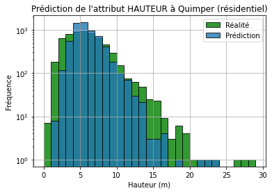
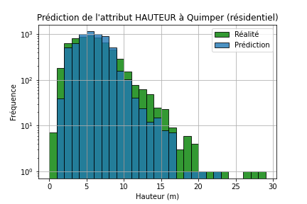
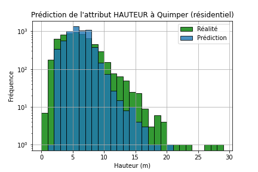

# Rapport d'avancement 8

Pendant cette semaine, nous travaillons sur une nouvelle méthode de prédiction mélangeant K-NN et forêt aléatoire, et nous la comparons avec chacune des 2 méthodes prises indépendamment.

## 1. Implémentation de la nouvelle méthode

Pour réaliser cette nouvelle prédiction, nous commençons par calculer pour chaque bâtiment les 5 autres bâtiments les plus proches (nombre de voisins $k = 5$).\
On utilise pour cela la méthode `NearestNeighbors` de Scikit-Learn, à laquelle on fournit les coordonnées $(x, y)$ des centroïdes des bâtiments, et en la paramétrant pour qu'elle retourne la matrice des distances de chaque bâtiment par rapport à ses plus proches voisins.\
\
Ensuite, on construit un vecteur de forme $(X_0, X_1, ..., X_5)$ avec :

$\forall i \in [0, 5] X_i = ({NATURE}_i, {USAGE1}_i, {LEGER}_i, {DATE APP}_i, {SURFACE}_i, {dist}_{0 \rightarrow i})$

avec $X_0$ le vecteur des attributs du bâtiment courant, les 5 autres vecteurs représentant ceux des voisins.\
\
Pour obtenir ce vecteur, nous avons réalisé des jointures entre DataFrames avec la méthode `df.merge`.\
Nous avons finalement réitéré la prédiction par forêt aléatoire avec `RandomForestRegressor`.

## 2. Comparaison avec les méthodes précédentes

Pour tester la performance du Random Forest, nous avons cette fois-ci réalisé nos prédictions sur tous les types de bâtiment.\
Pour des raisons de temps, nous n'avons cependant pu tester l'algorithme que sur la ville de Quimper.\
\
Voici les résultats obtenus pour la prédiction de la hauteur :

| | Histogramme | MAE (m) |
|:-:|:-:|:-:|
| 5-NN |  | 1.64 |
| RandomForest |  | 1.72 |
| Mix |  | 1.46 |

On observe que cette nouvelle méthode permet de réduire la MAE sur la ville de Quimper d'environ 20 à 30 cm par rapport aux K-NN et RandomForest seuls.\
Il faudrait tester la méthode sur la ville de Paris pour vérifier si nous pouvons obtenir des améliorations similaires, avec de plus grandes densité et variété de bâtiments.
