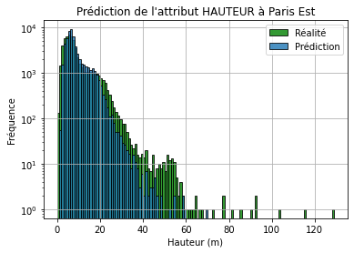
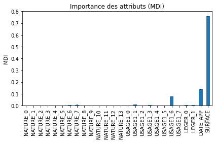
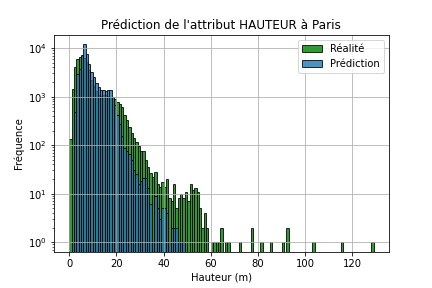
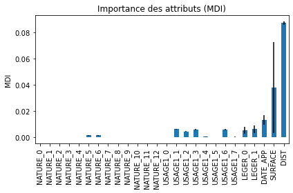
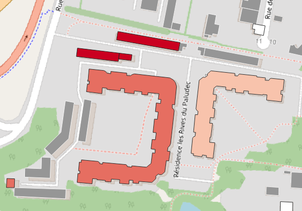
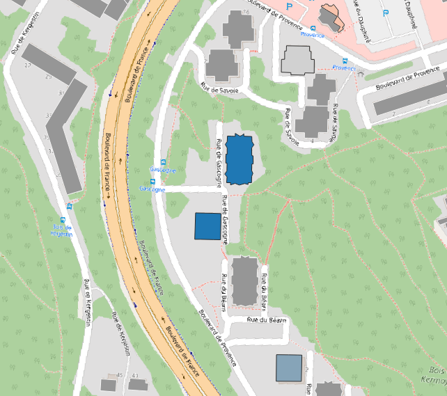

# Rapport d'avancement 9

Pendant cette semaine, nous ajustons le fonctionnement de l'algorithme KNN+RandomForest, et nous testons cette méthode de prédiction sur l'est de Paris.\
En parallèle, nous observons quelques résultats de mauvaises prédictions sur Quimper.

## 1. Ajustement de l'algorithme RandomForest+KNN

La méthode de prédiction mélangeant plus proches voisins et forêt aléatoire semblait fonctionner sur la ville de Quimper, mais l'encodage des données fournies à l'algorithme posait un problème : en remplaçant les valeurs des attributs $NATURE$ et $USAGE$ par des nombres entiers, on introduit un biais dans le fonctionnement du programme.\
En effet, $NATURE = 0$ est considéré comme plus proche de $NATURE = 1$ que $NATURE = 5$ en raison de la hiérarchie des entiers ; or en réalité ces nombres ne sont pas choisis pour classer les natures de bâtiment par ordre de similarité.\
De plus, cette méthode nécessite un processus d'encodage manuel long par le biais d'un second fichier, que l'on préférerais éviter.\
\
Pour corriger cela, on utilise la méthode ```OneHotEncoder``` du module ```sklearn.preprocessing``` qui permet de générer automatiquement, à partir d'une liste de valeurs discrètes d'un attribut, un encodage sous forme de liste binaire (0 ou 1), ce qui évite l'introduction d'un biais lié à la manière d'encoder les données, tout en rendant le code plus clair.\
Nous implémentons cette méthode pour les attributs $NATURE$, $USAGE$ et $LEGER$.\
\
Une autre amélioration que nous apportons à notre algorithme est la gestion de l'importance des attributs.\
Si notre algorithme utilise 6 attributs pour chacun des voisins afin de réaliser une prédiction, il serait intéressant de savoir lesquels sont les plus déterminants, et lesquels plus négligeables : cela permettrait éventuellement d'ajuster les attributs choisis et d'évaluer la pertinence de l'algorithme.\
\
On utilise pour cela le paramètre ```feature_importances``` du RandomForest, qui permet d'indiquer la pondération de chacun des paramètres du calcul avec l'écart-type associé.\
Nous avons tracé graphiquement cette information dans les prédictions sur Paris.

## 2. Prédiction sur Paris

Nous avons testé l'algorithme KNN+RandomForest sur l'est de Paris, en le comparant avec les résultats obtenus par K-NN et RandomForest seuls :

Voici les résultats obtenus pour la prédiction de la hauteur :

* K-NN

| Histogramme |
|:-:|
|  |

| | *Global* | *-10 m* | *10-30 m* | *+30 m* |
|:-:|:-:|:-:|:-:|:-:|
| **MAE (m)** | 2.7 | 2.0 | 4.0 | 18.8 |

-----
  
* RandomForest

| Histogramme | FeatureImportances |
|:-:|:-:|
|  |  |

| | *Global* | *-10 m* | *10-30 m* | *+30 m* |
|:-:|:-:|:-:|:-:|:-:|
| **MAE (m)** | 3.8 | 2.7 | 6.2 | 23.2 |

On constate que seul l'attribut $SURFACE$ est très significatif dans le calcul, et que $DATE APP$ a une légère importance suivi de l' $USAGE$.\
Les autres attributs jouent un rôle quasi-nul dans la prédiction par RandomForest seul.

-----

* Mix

| Histogramme | FeatureImportances |
|:-:|:-:|
|  |  |

| | *Global* | *-10 m* | *10-30 m* | *+30 m* |
|:-:|:-:|:-:|:-:|:-:|
| **MAE (m)** | 3.2 | 2.4 | 4.9 | 19.8 |

On constate cette fois-ci que la prédiction réalisée est un peu meilleure qu'avec le RandomForest seul, mais moins bonne qu'avec le K-NN seul, ce qui est plutôt décevant compte tenu de la complexité de la méthode et du temps d'exécution (15 heures contre 6 jours)...\
On remarque notamment qu'aucun bâtiment n'est prédit avec une hauteur de plus de 50 m de haut, ce qui peut être problématique pour certains quartiers de Paris (et de sa proche banlieue) constitués de tours résidentielles.
Nous essayerons de réduire le nombre d'arbres et la profondeur maximale pour espérer obtenir de meilleurs résultats.\
\
L'importance des attributs est légèrement différente par rapport au RandomForest seul : c'est la distance qui devient la plus significative (ce qui est cohérent avec nos précédentes prédictions sur la hauteur), suivie de la surface au sol et de la date d'apparition.\
L'usage et la structure (légère ou non) ont un poids plus important dans le calcul qu'avec l'algorithme RandomForest seul.

## 3. Analyse des mauvaises prédictions sur Quimper

Nous observons en détail quelques mauvaises prédictions sur la ville de Quimper, pour essayer d'en déterminer les causes.

* Résidence Les Rives du Paludec



On observe ici une erreur relative positive d'environ 300% sur les bâtiments en longueur (en rouge très foncé) : il s'agit des garages attenant à la résidence.\
Cette erreur est due à un mauvais renseignement de ces bâtiments dans la BDTOPO : ils sont classés comme ```Résidentiel```, avec un nombre de logements non nul, et un attribut ```HAUTEUR``` lui-même erronné (1.5 m, ce qui est vraisemblablement faux).\
Les bâtiments de la résidence ont aussi une erreur relative importante (30% à 70%) car ils sont fusionnés en 1 seul bloc dans la BDTOPO, ce qui gonfle artificiellement leur surface au sol et donc leur hauteur prédite.

* Kermoysan



Ici, au contraire, la hauteur prédite est bien plus basse qu'en réalité : on observe des erreurs relatives de l'ordre de -75% sur les prédictions de ces bâtiments, ce qui est surprenant car il s'agit d'un quartier relativement homogène, où les bâtiments voisins ont des hauteurs réelles et surfaces au sol comparables.\
Nous n'avons pas réussi à déterminer l'origine de ces écarts si importants (+ de 30 m en absolu).
